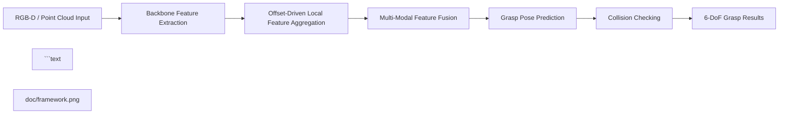

<h2 align="center">
  A Multi-Modal Framework with Offset-Driven Local Feature Aggregation for 6-DoF Grasp Pose Estimation
</h2>

<p align="center">
  <a href="https://github.com/huamo555/DOGraspNet"></a>
  <a href="https://github.com/huamo555/DOGraspNet"></a>
  
  
  
  <a href="LICENSE"></a>
  
  
  <a href="LICENSE"></a>
</p>

<p align="center">
  <a href="#highlights">Highlights</a> |
  <a href="#method-overview">Method</a> |
  <a href="#getting-started">Getting Started</a> |
  <a href="#news">News</a> |
  <a href="#overview">Overview</a> |
  <a href="#framework">Framework</a> |
  <a href="#installation">Installation</a> |
  <a href="#training">Training</a> |
  <a href="#evaluation">Evaluation</a> |
  <a href="#citation">Citation</a>
</p>

> Official implementation of **DOGraspNet**, accepted by **IROS 2026**.  
> This repository provides training, inference, visualization, and evaluation code for multi-modal 6-DoF grasp pose estimation in cluttered scenes.
<p align="center">
  Official implementation of <b>DOGraspNet</b>, accepted by <b>IROS 2026</b>.
</p>

## News

- **2026-06**: Repository released.
- **2026-06**: DOGraspNet accepted to **IROS 2026**.
- **2026-06**: DOGraspNet was accepted by **IROS 2026**.
- **2026-06**: The official repository was released.
- **Coming soon**: Pretrained checkpoints, final benchmark tables, and detailed data preparation instructions.

## Overview

DOGraspNet is a multi-modal 6-DoF grasp pose estimation framework designed for cluttered robotic manipulation scenes. The core idea is to enhance local geometric representation through **offset-driven local feature aggregation**, enabling the network to reason more effectively about graspable regions, object surfaces, and local spatial structures.

This repository provides the full research codebase for training, testing, visualization, collision checking, and AP/APu evaluation.

## Highlights

- **Offset-driven local feature aggregation** for learning geometry-aware grasp features around candidate regions.
- **Multi-modal perception** that combines complementary cues for robust grasp pose estimation.
- **6-DoF grasp prediction** in cluttered scenes, targeting practical robotic manipulation.
- **Complete experimental pipeline** including training, testing, collision-aware evaluation, AP/APu computation, and grasp visualization.
- **GraspNet-compatible workflow** for benchmark evaluation and comparison with existing methods.
- **Offset-driven local feature aggregation** for stronger local geometric perception.
- **Multi-modal feature learning** for robust grasp pose estimation in cluttered scenes.
- **6-DoF grasp prediction** compatible with GraspNet-style benchmark evaluation.
- **Collision-aware testing scripts** for more practical grasp quality assessment.
- **Visualization tools** for qualitative inspection of predicted grasp poses.
- **End-to-end experimental pipeline** including training, inference, evaluation, and metric computation.

## Method Overview
## Framework

DOGraspNet focuses on strengthening local geometric reasoning for 6-DoF grasp pose estimation. The model aggregates offset-driven neighborhood features and fuses multi-modal information to produce reliable grasp candidates in complex scenes.
Please place your framework image at:



Then it will be shown automatically below:

<p align="center">
  
</p>

## Repository Structure

```text
|-- data_utils.py                    # Data processing utilities
|-- get_AP_and_APu.py                # AP/APu metric computation
|-- graspnet.py                      # Main network definition
|-- infer_vis_grasp*.py              # Inference and visualization scripts
|-- infer_vis_grasp.py               # Inference and visualization
|-- infer_vis_grasp_singleObject.py  # Single-object visualization
