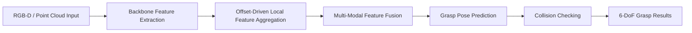

  <b>A Multi-Modal Framework with Offset-Driven Local Feature Aggregation for 6-DoF Grasp Pose Estimation</b>

  
  
  
  
  

  <a href="#highlights">Highlights</a> |
  <a href="#method-overview">Method</a> |
  <a href="#getting-started">Getting Started</a> |
  <a href="#training">Training</a> |
  <a href="#evaluation">Evaluation</a> |
  <a href="#citation">Citation</a>

Official implementation of DOGraspNet, accepted by IROS 2026.
This repository provides training, inference, visualization, and evaluation code for multi-modal 6-DoF grasp pose estimation in cluttered scenes.

News
2026-06: Repository released.
2026-06: DOGraspNet accepted to IROS 2026.
Highlights
Offset-driven local feature aggregation for learning geometry-aware grasp features around candidate regions.
Multi-modal perception that combines complementary cues for robust grasp pose estimation.
6-DoF grasp prediction in cluttered scenes, targeting practical robotic manipulation.
Complete experimental pipeline including training, testing, collision-aware evaluation, AP/APu computation, and grasp visualization.
GraspNet-compatible workflow for benchmark evaluation and comparison with existing methods.
Method Overview
DOGraspNet focuses on strengthening local geometric reasoning for 6-DoF grasp pose estimation. The model aggregates offset-driven neighborhood features and fuses multi-modal information to produce reliable grasp candidates in complex scenes.

Repository Structure
DOGraspNet/
|-- dataset/                         # Dataset loading and preprocessing
|-- doc/                             # Figures, documents, and supplementary assets
|-- graspnetAPI/                     # GraspNet evaluation utilities
|-- knn/                             # KNN CUDA/C++ extensions
|-- pointnet2/                       # PointNet++ operators and modules
|-- SE_resUnet.py                    # SE-ResUNet module
|-- backbone_resunet14.py            # Backbone network
|-- collision_detector.py            # Collision checking
|-- data_utils.py                    # Data processing utilities
|-- get_AP_and_APu.py                # AP/APu metric computation
|-- graspnet.py                      # Main network definition
|-- infer_vis_grasp*.py              # Inference and visualization scripts
|-- label_generation.py              # Label generation
|-- loss.py / loss_utils.py          # Training losses
|-- modules.py                       # Core network blocks
|-- train.py                         # Training entry point
|-- test.py                          # Testing entry point
`-- command_*.sh                     # Ready-to-run training/testing scripts
Getting Started
1. Clone the repository
git clone https://github.com/huamo555/DOGraspNet.git
cd DOGraspNet
2. Create the environment
conda create -n dograspnet python=3.8 -y
conda activate dograspnet
pip install -r requirements.txt
3. Build CUDA extensions
The repository uses custom operators under pointnet2/ and knn/. Build them before training or evaluation.
cd pointnet2
python setup.py install
cd ../knn
python setup.py install
cd ..
If your environment already includes compiled extensions, this step can be skipped.
Dataset
DOGraspNet follows the GraspNet-1Billion benchmark protocol. Please download and organize the dataset according to the official GraspNet instructions.
Recommended layout:
data/
`-- graspnet/
    |-- scenes/
    |-- models/
    |-- dex_models/
    |-- grasp_label/
    `-- collision_label/
After downloading the dataset, update the dataset path in your training/testing configuration or command scripts.
Training
The repository provides shell scripts for convenient training.
bash command_train_re.sh
For KNN-based training:
bash command_train_kn.sh
You can also call the training entry point directly:
python train.py
Before launching training, check the following items:
Dataset root path is correct.
CUDA extensions are compiled.
Batch size fits your GPU memory.
Checkpoint and log directories are writable.
Evaluation
Run the provided testing scripts:
bash command_test_re.sh
For KNN-based testing:
bash command_test_kn.sh
Collision-aware evaluation scripts are also provided:
bash command_test_re_pengzhuangjiance.sh
bash command_test_kn_pengzhuangjiance.sh
Compute AP and APu metrics:
python get_AP_and_APu.py
Inference and Visualization
Visualize grasp predictions on benchmark scenes:
python infer_vis_grasp.py
Single-object visualization:
python infer_vis_grasp_singleObject.py
Additional visualization entry:
python infer_vis_grasp_wupeng.py
Results
Please replace the placeholder values below with the final numbers from the accepted paper.
GraspNet-1Billion Benchmark
Method	Seen AP	Similar AP	Novel AP	APu	Notes
Baseline	TBD	TBD	TBD	TBD	Reproduced baseline
DOGraspNet	TBD	TBD	TBD	TBD	Ours

Ablation Study
Setting	Seen AP	Similar AP	Novel AP	Key Difference
w/o offset-driven aggregation	TBD	TBD	TBD	Removes local offset reasoning
w/o multi-modal fusion	TBD	TBD	TBD	Uses limited modality input
Full DOGraspNet	TBD	TBD	TBD	Complete model

Model Zoo
Checkpoint	Dataset	Metric	Download
DOGraspNet	GraspNet-1Billion	TBD	Coming soon

TODO

Release pretrained checkpoints.

Add detailed dataset preparation instructions.

Add final benchmark tables from the paper.

Add qualitative visualization figures.

Add demo video and project page link.
Citation
If this project is helpful for your research, please consider citing our paper:
@inproceedings{dograspnet2026,
  title     = {A Multi-Modal Framework with Offset-Driven Local Feature Aggregation for 6-DoF Grasp Pose Estimation},
  author    = {TODO},
  booktitle = {IEEE/RSJ International Conference on Intelligent Robots and Systems (IROS)},
  year      = {2026}
}
Acknowledgements
This project builds upon the GraspNet benchmark and related open-source 6-DoF grasp pose estimation frameworks. We sincerely thank the authors and contributors of these projects for advancing robotic grasping research.
License
This repository is released under the license specified in LICENSE.
