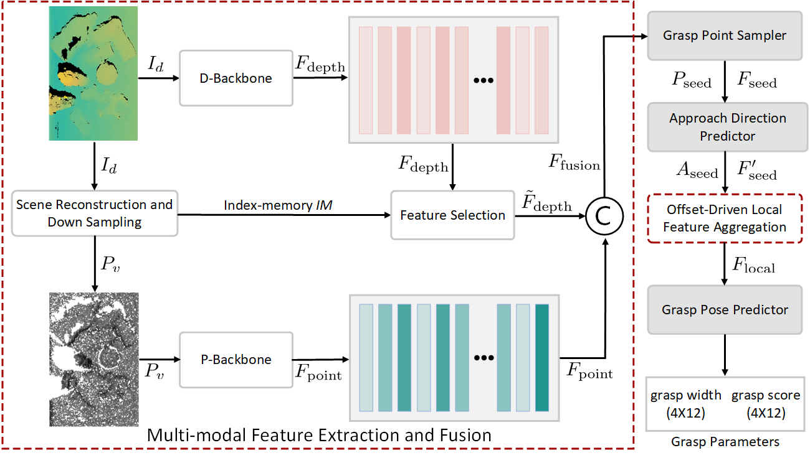

# DOGraspNet

<p align="center">
  
</p>

<h3 align="center">
  A Multi-Modal Framework with Offset-Driven Local Feature Aggregation<br>
  for 6-DoF Grasp Pose Estimation
</h3>

<p align="center">
  <a href="https://github.com/huamo555/DOGraspNet"></a>
  
  
  
  <a href="LICENSE"></a>
</p>

<p align="center">
  <a href="#news">News</a> |
  <a href="#overview">Overview</a> |
  <a href="#method">Method</a> |
  <a href="#installation">Installation</a> |
  <a href="#quick-start">Quick Start</a> |
  <a href="#results">Results</a> |
  <a href="#citation">Citation</a>
</p>

<p align="center">
  Official implementation of <b>DOGraspNet</b>, accepted to <b>IROS 2026</b>.
</p>

---

## News

- **2026-06**: DOGraspNet was accepted to **IROS 2026**.
- **2026-06**: The official project repository was released.
- **Coming soon**: Paper link, pretrained checkpoints, detailed data preparation guide, and final benchmark tables.

## Overview

DOGraspNet is a multi-modal framework for **6-DoF robotic grasp pose estimation** in cluttered scenes. It is designed to strengthen local geometric reasoning through **offset-driven local feature aggregation**, allowing the model to better capture graspable structures from noisy and partial RGB-D observations.

The repository provides a complete research pipeline for training, testing, visualization, collision checking, and GraspNet-style evaluation.

## Highlights

<table>
  <tr>
    <td><b>Offset-driven local aggregation</b></td>
    <td>Enhances local geometric features around candidate grasp regions.</td>
  </tr>
  <tr>
    <td><b>Multi-modal representation</b></td>
    <td>Combines complementary scene cues for more robust grasp prediction.</td>
  </tr>
  <tr>
    <td><b>6-DoF grasp generation</b></td>
    <td>Predicts full spatial grasp poses for cluttered robotic manipulation.</td>
  </tr>
</table>

## Method

DOGraspNet focuses on the local geometry that is most relevant to grasp pose estimation. Instead of treating all scene points uniformly, the model uses offset-driven local feature aggregation to collect informative neighboring structures around grasp candidates and improve the discriminability of local grasp representations.

The overall pipeline contains:

1. **Scene feature extraction** from RGB-D / point cloud observations.
2. **Offset-driven local feature aggregation** to enhance local grasp-aware geometry.
3. **Multi-modal feature fusion** for robust grasp quality and pose prediction.
4. **6-DoF grasp decoding** with optional collision-aware post-processing.
5. **Benchmark evaluation** on GraspNet-style metrics.

### Framework

<p align="center">
  
</p>

## Repository Structure

```text
DOGraspNet/
|-- dataset/                         # Dataset loading and preprocessing
|-- doc/                             # Figures, documents, and supplementary assets
|-- graspnetAPI/                     # GraspNet evaluation utilities
|-- knn/                             # KNN CUDA/C++ extensions
|-- pointnet2/                       # PointNet++ operators and modules
|-- SE_resUnet.py                    # SE-ResUNet module
|-- backbone_resunet14.py            # Backbone network
|-- collision_detector.py            # Collision checking
|-- data_utils.py                    # Data processing utilities
|-- get_AP_and_APu.py                # AP / APu metric computation
|-- graspnet.py                      # Main network definition
|-- infer_vis_grasp.py               # Inference and visualization
|-- infer_vis_grasp_singleObject.py  # Single-object visualization
|-- infer_vis_grasp_wupeng.py        # Additional visualization script
|-- label_generation.py              # Label generation
|-- loss.py                          # Training losses
|-- loss_utils.py                    # Loss utilities
|-- modules.py                       # Core network modules
|-- train.py                         # Training entry point
|-- test.py                          # Testing entry point
|-- command_train_re.sh              # Training script
|-- command_train_kn.sh              # KNN training script
|-- command_test_re.sh               # Testing script
|-- command_test_kn.sh               # KNN testing script
|-- command_test_re_pengzhuangjiance.sh
|-- command_test_kn_pengzhuangjiance.sh
`-- requirements.txt
```

## Installation

### 1. Clone

```bash
git clone https://github.com/huamo555/DOGraspNet.git
cd DOGraspNet
```

### 2. Create Environment

```bash
conda create -n dograspnet python=3.8 -y
conda activate dograspnet
pip install -r requirements.txt
```

### 3. Compile CUDA Extensions

```bash
cd pointnet2
python setup.py install

cd ../knn
python setup.py install

cd ..
```

If compilation fails, please check the compatibility of PyTorch, CUDA, GCC, and your GPU driver.

## Dataset Preparation

This project follows the **GraspNet-1Billion** benchmark setting. Please download the dataset from the official GraspNet website and organize it as follows:

```text
data/
`-- graspnet/
    |-- scenes/
    |-- models/
    |-- dex_models/
    |-- grasp_label/
    `-- collision_label/
```

Then update the dataset root path in the corresponding scripts or configuration files.

## Quick Start

### Training

```bash
bash command_train_re.sh
```

For the KNN version:

```bash
bash command_train_kn.sh
```

You can also launch training directly:

```bash
python train.py
```

Before training, please confirm that:

- The dataset path has been configured correctly.
- `pointnet2/` and `knn/` have been compiled successfully.
- The batch size matches your GPU memory.
- The checkpoint and log directories exist.

### Testing

```bash
bash command_test_re.sh
```

For the KNN version:

```bash
bash command_test_kn.sh
```

With collision checking:

```bash
bash command_test_re_pengzhuangjiance.sh
bash command_test_kn_pengzhuangjiance.sh
```

### Evaluation

```bash
python get_AP_and_APu.py
```

### Visualization

```bash
python infer_vis_grasp.py
python infer_vis_grasp_singleObject.py
python infer_vis_grasp_wupeng.py
```

## Results

Final benchmark numbers will be updated after paper release.

### GraspNet-1Billion

| Method | Seen AP | Similar AP | Novel AP | APu |
| --- | ---: | ---: | ---: | ---: |
| Baseline | TBD | TBD | TBD | TBD |
| DOGraspNet | TBD | TBD | TBD | TBD |

### Ablation Study

| Setting | Seen AP | Similar AP | Novel AP |
| --- | ---: | ---: | ---: |
| w/o offset-driven local feature aggregation | TBD | TBD | TBD |
| w/o multi-modal fusion | TBD | TBD | TBD |
| Full DOGraspNet | TBD | TBD | TBD |

## Model Zoo

| Model | Dataset | Metric | Checkpoint |
| --- | --- | --- | --- |
| DOGraspNet | GraspNet-1Billion | TBD | Coming soon |

## Roadmap

- [ ] Release the paper link.
- [ ] Release pretrained checkpoints.
- [ ] Add detailed dataset preparation instructions.
- [ ] Add final GraspNet-1Billion benchmark results.
- [ ] Add qualitative visualization examples.
- [ ] Add project page and demo video.

## Citation

If you find this project useful, please consider citing our paper:

```bibtex
@inproceedings{dograspnet2026,
  title     = {A Multi-Modal Framework with Offset-Driven Local Feature Aggregation for 6-DoF Grasp Pose Estimation},
  author    = {TODO},
  booktitle = {IEEE/RSJ International Conference on Intelligent Robots and Systems (IROS)},
  year      = {2026}
}
```

## Acknowledgements

This project is built upon the GraspNet benchmark and related open-source 6-DoF grasp pose estimation projects. We sincerely thank the authors and contributors for their valuable work.

## Contact

For questions, suggestions, or collaboration, please open an issue in this repository.

## License

This repository is released under the license specified in [LICENSE](LICENSE).
